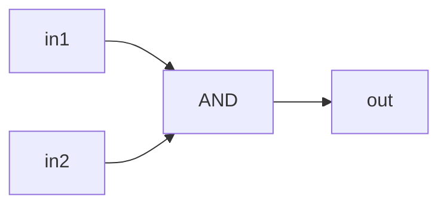
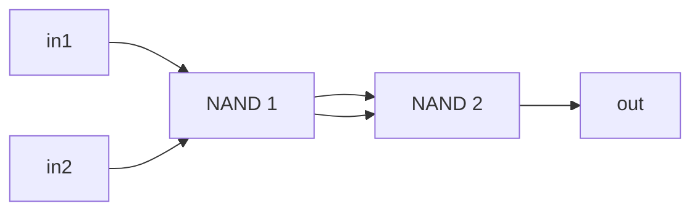
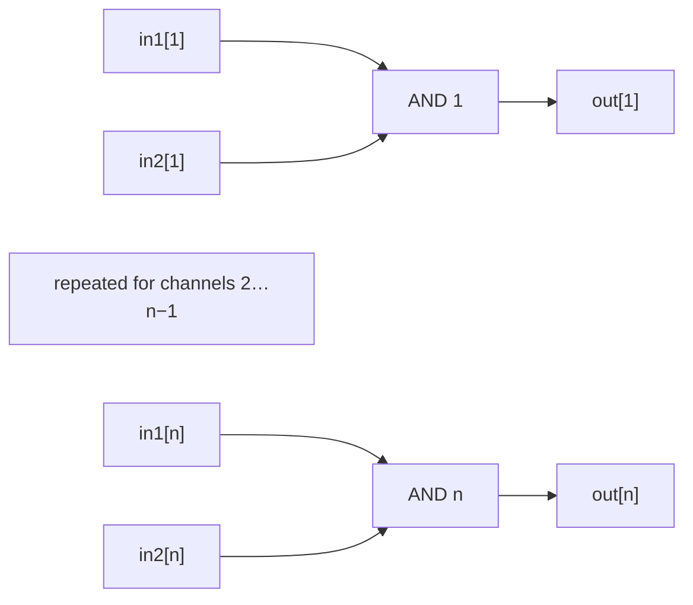
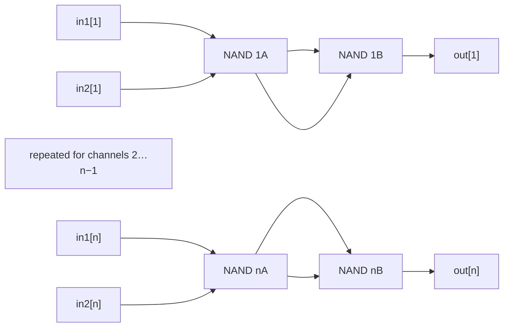

# AND Circuits — Theory

## AND

### Implementation

See [`AND`](./AND) for MHRD implementation.

`AND` outputs `1` only when both one-bit inputs are `1`.

### Boolean expressions

Boolean notation:

$$
\mathrm{out} = \mathrm{in1} \land \mathrm{in2}
$$

Using only `NAND` primitives:

Idempotent law:

$$
x\land x=x
$$

Double-negation law:

$$
\neg\neg x=x
$$

$$
\begin{aligned}
r &= \mathrm{NAND}(\mathrm{in1},\mathrm{in2}) \\
  &= \neg(\mathrm{in1}\land\mathrm{in2}) \\
\mathrm{out} &= \mathrm{NAND}(r,r) \\
             &= \neg r \\
             &= \mathrm{in1}\land\mathrm{in2}
\end{aligned}
$$

Or:

```text
out = AND(in1, in2)
r   = NAND(in1, in2)
out = NAND(r, r)
```

### Truth table

| in1 | in2 | out |
|---:|---:|---:|
| 0 | 0 | 0 |
| 0 | 1 | 0 |
| 1 | 0 | 0 |
| 1 | 1 | 1 |

### Logic diagram



### Building the gate from NAND

Pass `in1` and `in2` into a `NAND`, then pass its output to a second `NAND`.

### NAND diagram



### Minimum NAND gates

**2 NAND gates**. One `NAND` produces the complement of `AND`, so a second gate
is required to invert it.

## ANDiB — AND4B and AND16B

### Implementation

See [`AND4B`](./AND4B) for the repository implementation. [`AND16B`](./AND16B)
is an interface specification; MHRD provides its implementation.

`ANDiB` applies the `AND` operation to $n$ bit pairs, in parallel. The in-game implementations use $n=4$ and $n=16$.

### Boolean expressions

Boolean notation:

$$
\mathrm{out}_i = \mathrm{in1}_i \land \mathrm{in2}_i,
\qquad 1 \le i \le n, \quad n \in \{4,16\}
$$

Or:

```text
out[i] = AND(in1[i], in2[i])
```

### Truth table

| in1[i] | in2[i] | out[i] |
|---:|---:|---:|
| 0 | 0 | 0 |
| 0 | 1 | 0 |
| 1 | 0 | 0 |
| 1 | 1 | 1 |

### Logic diagram



### Building the circuit from NAND

Use $n$ copies of the two-`NAND` construction in parallel.

### NAND diagram



### Minimum NAND gates

**$2n$ NAND gates**: **8** for `AND4B` and **32** for `AND16B`. Each independent
output needs one gate to form the complemented product and one gate to invert
it.
