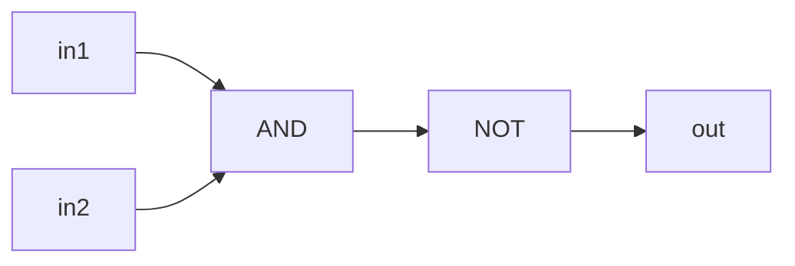
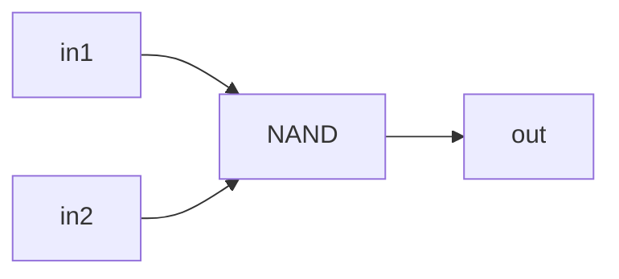
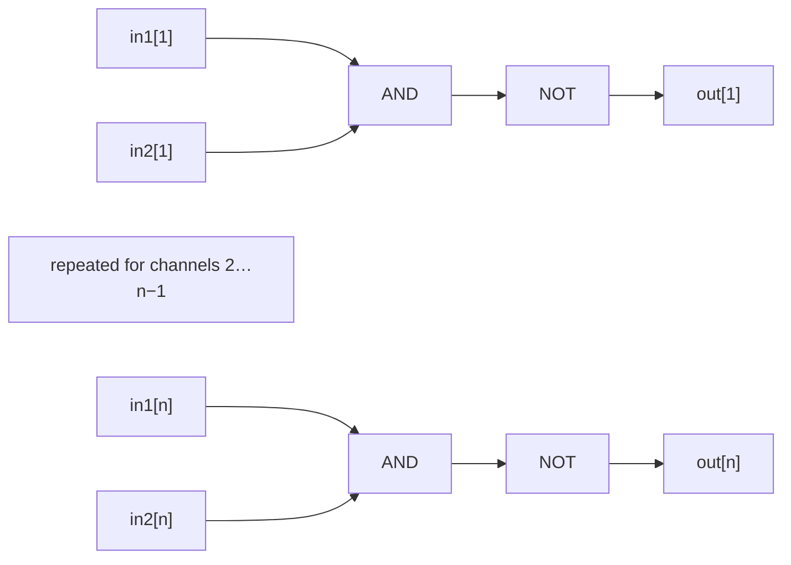
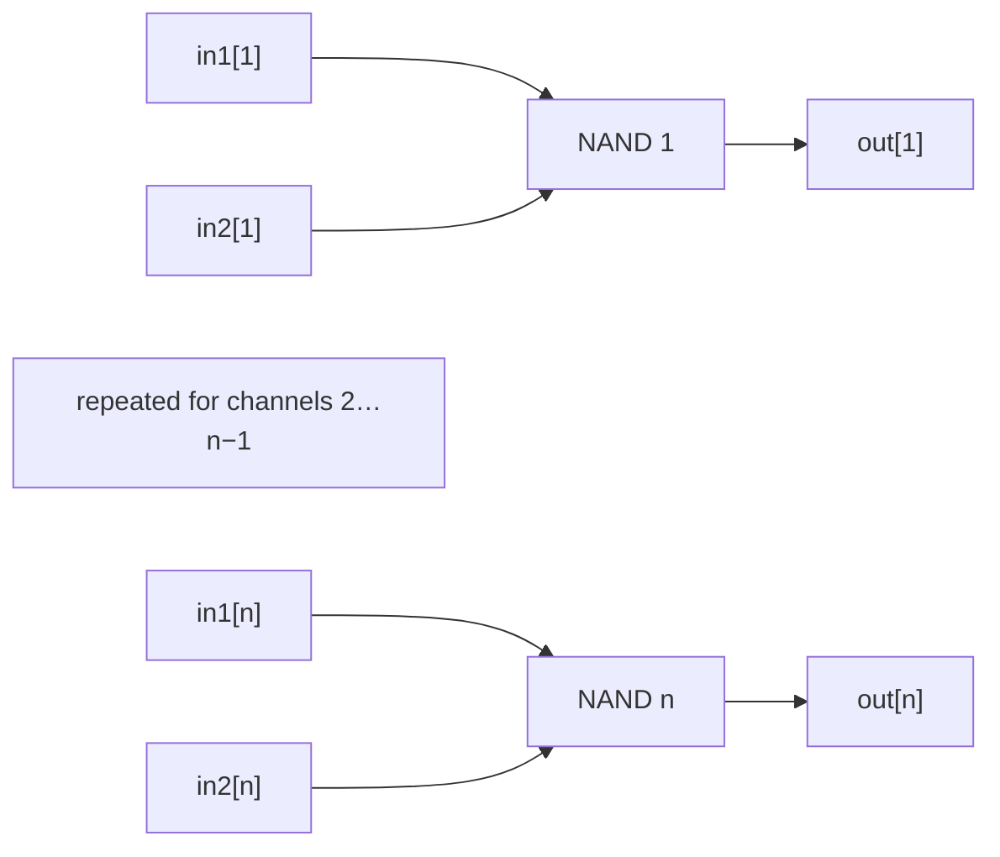

# NAND Circuits — Theory

## NAND

### Implementation

See [`NAND`](./NAND) for its interface specification. `NAND` is a primitive gate,
so MHRD provides its implementation.

`NAND` is the primitive gate provided by MHRD. It has two
one-bit inputs, `in1` and `in2`, and one one-bit output, `out`.

### Boolean expressions

Boolean notation:

$$
\begin{aligned}
r &= \mathrm{in1} \land \mathrm{in2} \\
\mathrm{out} &= \neg r \\
             &= \neg(\mathrm{in1} \land \mathrm{in2})
\end{aligned}
$$

Or:

```text
andResult = in1 AND in2
out       = NOT(andResult)
          = NOT(in1 AND in2)
```

### Truth table

| in1 | in2 | out |
|---:|---:|---:|
| 0 | 0 | 1 |
| 0 | 1 | 1 |
| 1 | 0 | 1 |
| 1 | 1 | 0 |

### Logic diagram



### Building the gate from NAND

`NAND` is already implemented.

### NAND diagram



### Minimum NAND gates

**1 NAND gate**. With no gate, an output can only be wired directly to an input
and therefore cannot depend on both inputs.

## NANDiB - NAND4B and NAND16B

### Implementation

See [`NAND4B`](./NAND4B) and [`NAND16B`](./NAND16B) for their interface
specifications. MHRD provides their implementations.

`NANDiB` applies the `NAND` operation to $n$ bit pairs, in parallel. The in-game implementations use $n=4$ and $n=16$.

### Boolean expressions

Boolean notation:

$$
\mathrm{out}_i
= \neg\left(\mathrm{in1}_i \land \mathrm{in2}_i\right),
\qquad 1 \le i \le n, \quad n \in \{4,16\}
$$

Or:

```text
out[i] = NOT(in1[i] AND in2[i])
```

### Truth Table

| in1[i] | in2[i] | out[i] |
|---:|---:|---:|
| 0 | 0 | 1 |
| 0 | 1 | 1 |
| 1 | 0 | 1 |
| 1 | 1 | 0 |

### Logic diagram



### Building the circuit from NAND

Use $n$ `NAND` gates in parallel.

### NAND diagram



### Minimum NAND gates

**$n$ NAND gates**: **4** for `NAND4B` and **16** for `NAND16B`. Every
independent output is a different two-input `NAND` function, and one gate
produces only one such output.
