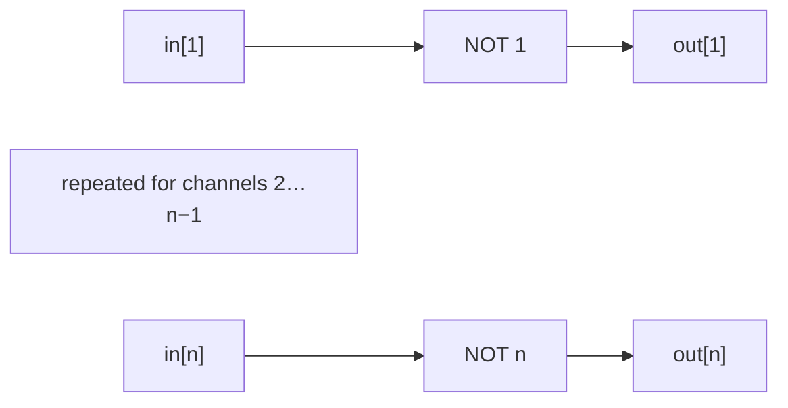
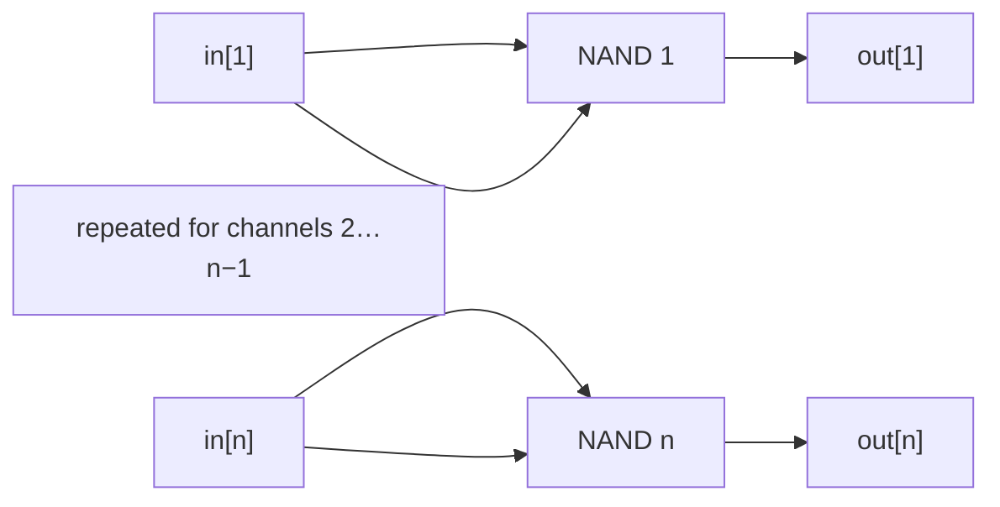

# NOT Circuits — Theory

## NOT

### Implementation

See [`NOT`](./NOT) for MHRD implementation.

`NOT` reverses a single Boolean value. It has one
one-bit input, `in`, and one one-bit output, `out`.

### Boolean expressions

 Boolean notation:

$$
\mathrm{out} = \neg\mathrm{in}
$$

Using only `NAND` primitives:

Idempotent law
$\mathrm{in}\land\mathrm{in}=\mathrm{in}$.

$$
\begin{aligned}
\mathrm{out}
    &= \mathrm{NAND}(\mathrm{in},\mathrm{in}) \\
    &= \neg(\mathrm{in}\land\mathrm{in}) \\
    &= \neg\mathrm{in}
\end{aligned}
$$


Or:

```text
out = NOT(in)
out = NAND(in, in)
```

### Truth Table

| in | out |
|---:|---:|
| 0 | 1 |
| 1 | 0 |

### Logic diagram


### Building the gate from NAND

Pass `in` to both inputs of a `NAND` gate.

### NAND diagram


### Minimum NAND gates

**1 NAND gate**. With no gate, the output can only be the unchanged input.

## NOTiB — NOT4B and NOT16B

### Implementation

See [`NOT4B`](./NOT4B) for the repository implementation. [`NOT16B`](./NOT16B)
is an interface specification; MHRD provides its implementation.

`NOTiB` applies the `NOT` operation to $n$ bits, in parallel. The in-game implementations use $n=4$ and $n=16$.

### Boolean expressions

For every bit position $i$, from 1 through $n$:

$$
\mathrm{out}_i = \neg\mathrm{in}_i,
\qquad 1 \le i \le n, \quad n \in \{4,16\}
$$

Or:

```text
out[i] = NOT(in[i])
```

### Truth Table

| in[i] | out[i] |
|---:|---:|
| 0 | 1 |
| 1 | 0 |

### Logic diagram



### Building the circuit from NAND

Use $n$ `NAND` gates in parallel, repeating the construction of the single `NOT` gate.

### NAND diagram



### Minimum NAND gates

**$n$ NAND gates**: **4** for `NOT4B` and **16** for `NOT16B`. Each output is
the inversion of a different input bit, so each needs its own gate.
