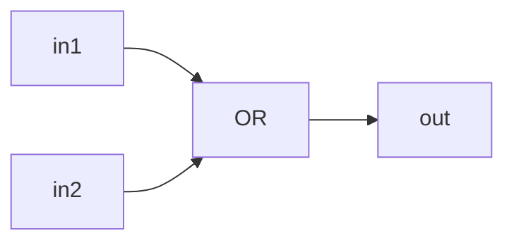
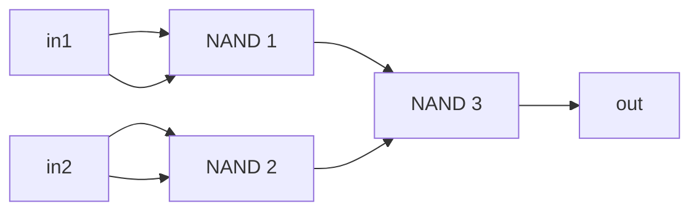
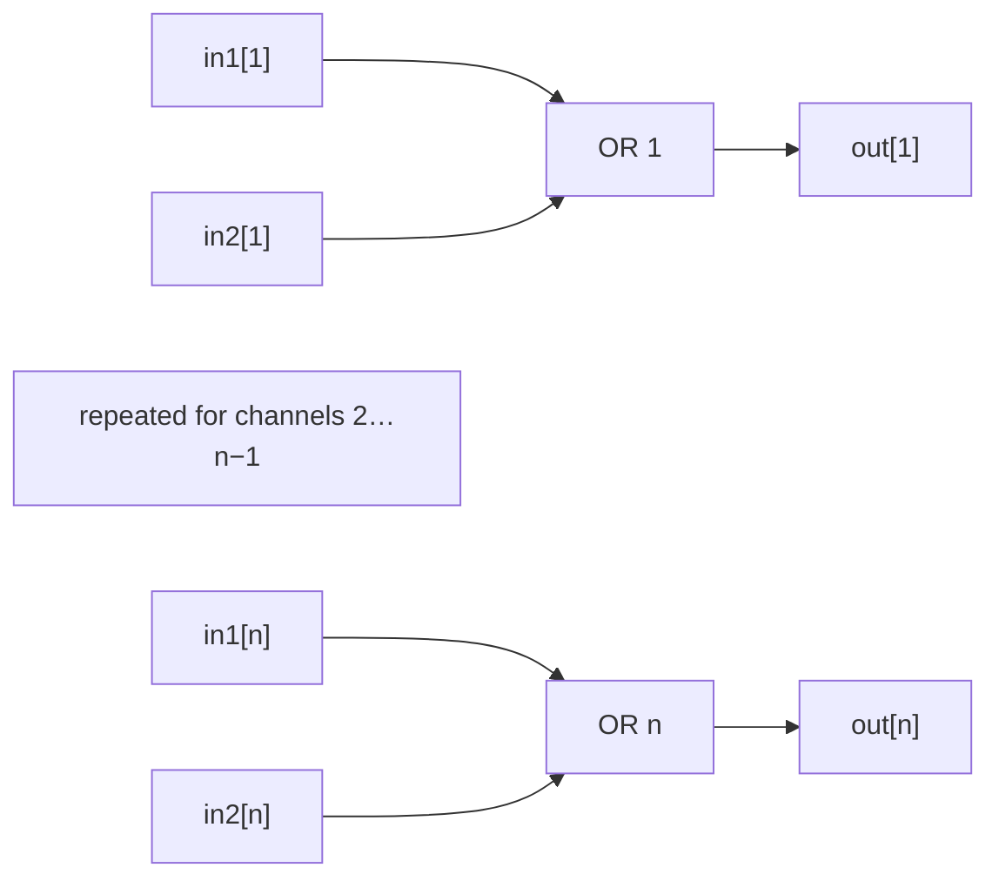
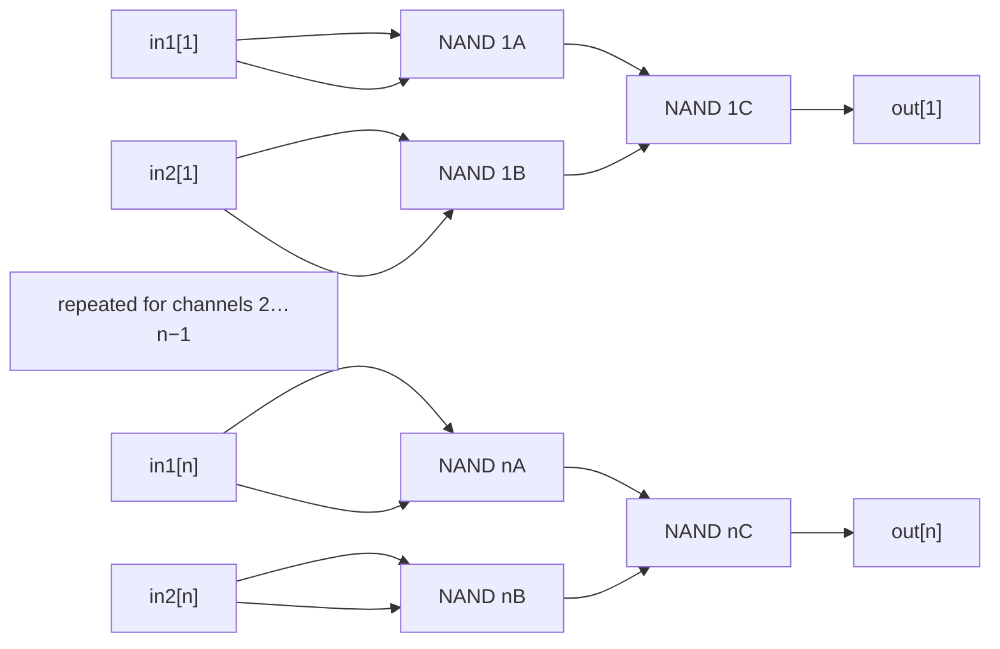
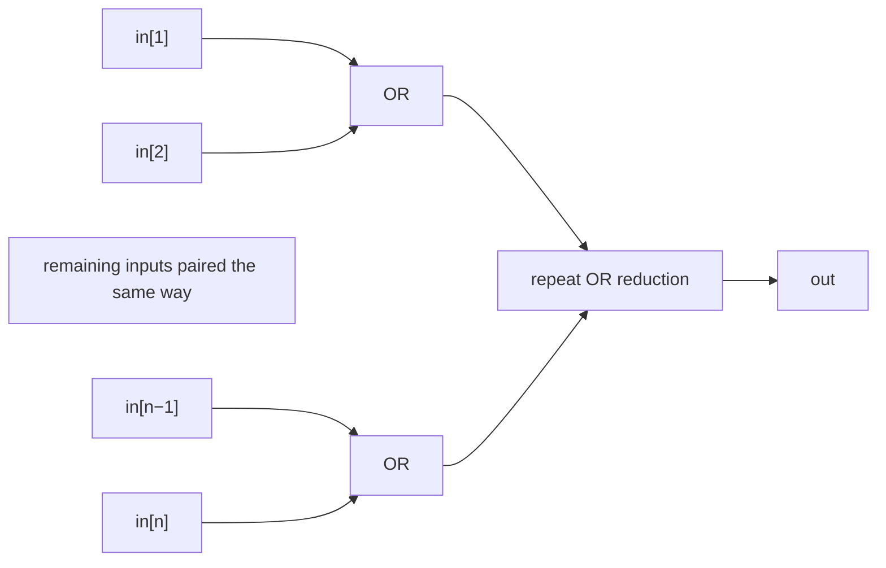
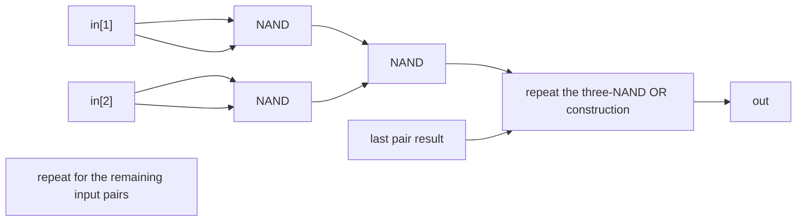

# OR Circuits — Theory

## OR

### Implementation

See [`OR`](./OR) for MHRD implementation.

`OR` outputs `1` when either or both one-bit inputs are `1`.

### Boolean expressions

Boolean notation:

$$
\mathrm{out} = \mathrm{in1} \lor \mathrm{in2}
$$

Using only `NAND` primitives.

Idempotent law:

$$
x\land x=x
$$

De Morgan's law:

$$
\neg(\neg x\land\neg y)=x\lor y
$$

$$
\begin{aligned}
a &= \mathrm{NAND}(\mathrm{in1},\mathrm{in1}) = \neg\mathrm{in1} \\
b &= \mathrm{NAND}(\mathrm{in2},\mathrm{in2}) = \neg\mathrm{in2} \\
\mathrm{out} &= \mathrm{NAND}(a,b) \\
             &= \neg(\neg\mathrm{in1}\land\neg\mathrm{in2}) \\
             &= \mathrm{in1}\lor\mathrm{in2}
\end{aligned}
$$

Or:

```text
out = OR(in1, in2)
a   = NAND(in1, in1)
b   = NAND(in2, in2)
out = NAND(a, b)
```

### Truth table

| in1 | in2 | out |
|---:|---:|---:|
| 0 | 0 | 0 |
| 0 | 1 | 1 |
| 1 | 0 | 1 |
| 1 | 1 | 1 |

### Logic diagram



### Building the gate from NAND

Invert both inputs with two `NAND` gates, then pass those results into a third `NAND`.

### NAND diagram



### Minimum NAND gates

**3 NAND gates**. Both independent inputs must be inverted before De Morgan's
law can produce `OR`; one final `NAND` combines those complements.

## ORiB — OR4B and OR16B

### Implementation

See [`OR4B`](./OR4B) and [`OR16B`](./OR16B) for their interface specifications.
MHRD provides their implementations.

`ORiB` applies the `OR` operation to $n$ bit pairs, in parallel. The in-game implementations use $n=4$ and $n=16$.

### Boolean expressions

Boolean notation:

$$
\mathrm{out}_i = \mathrm{in1}_i \lor \mathrm{in2}_i,
\qquad 1 \le i \le n, \quad n \in \{4,16\}
$$

Or:

```text
out[i] = OR(in1[i], in2[i])
```

### Truth table

| in1[i] | in2[i] | out[i] |
|---:|---:|---:|
| 0 | 0 | 0 |
| 0 | 1 | 1 |
| 1 | 0 | 1 |
| 1 | 1 | 1 |

### Logic diagram



### Building the circuit from NAND

Use $n$ copies of the three-`NAND` construction in parallel.

### NAND diagram



### Minimum NAND gates

**$3n$ NAND gates**: **12** for `OR4B` and **48** for `OR16B`. Each channel uses
different inputs, so its gates cannot be shared with another channel.

## ORiW — OR4W and OR16W

### Implementation

See [`OR4W`](./OR4W) for the repository implementation. [`OR16W`](./OR16W) is
an interface specification; MHRD provides its implementation.

`ORiW` reduces one $n$-bit input bus to one bit. Its output is `1` when at least one input bit is `1`.

### Boolean expressions

Boolean notation:

$$
\mathrm{out} = \bigvee_{i=1}^{n}\mathrm{in}_i,
\qquad n \in \{4,16\}
$$

Or:

```text
out = in[1] OR in[2] OR ... OR in[n]
```

### Truth table

| Input bus | out |
|---|---:|
| all bits are `0` | 0 |
| at least one bit is `1` | 1 |

### Logic diagram



### Building the circuit from NAND

Build a balanced tree of `OR` gates, then replace every `OR` with its three-`NAND` construction.

### NAND diagram



### Minimum NAND gates

**$3(n-1)$ NAND gates** for this binary `OR` reduction: **9** for `OR4W` and
**45** for `OR16W`. A reduction of $n$ inputs contains $n-1$ two-input `OR`
nodes, each using three `NAND` gates. Balancing minimizes depth without changing
this gate count.
