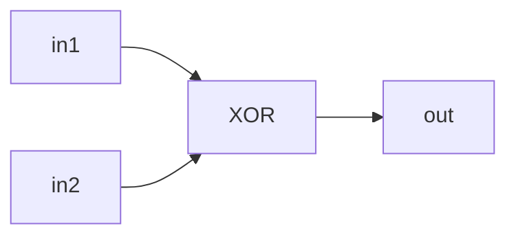
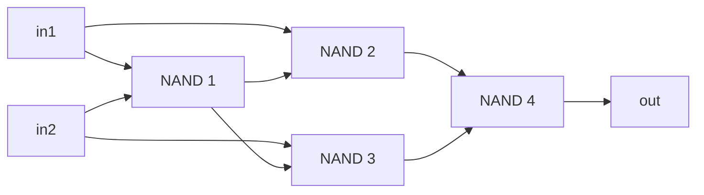
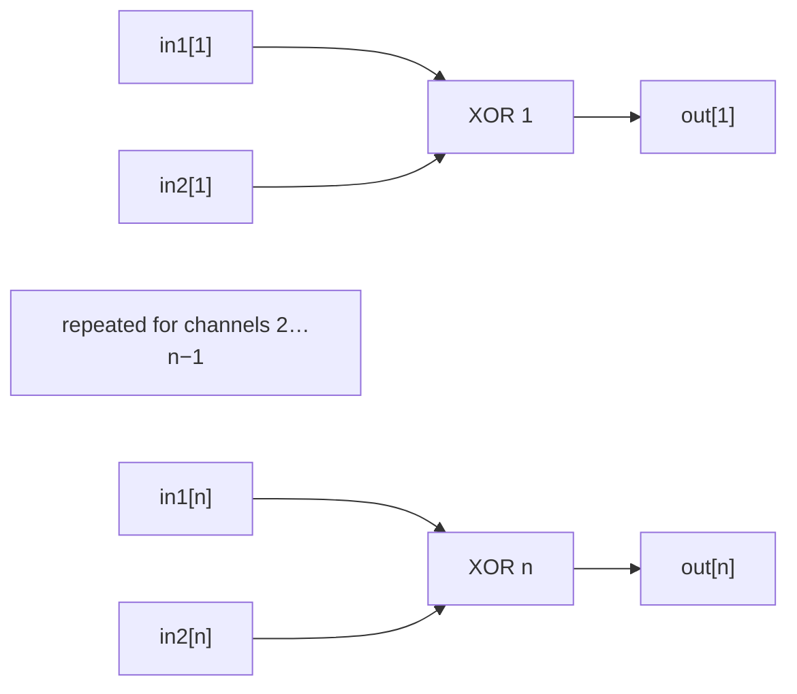
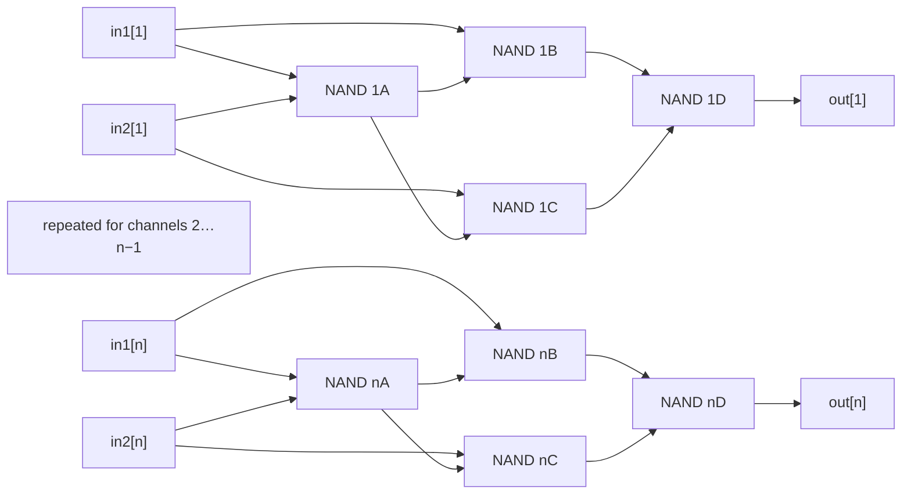

# XOR Circuits — Theory

## XOR

### Implementation

See [`XOR`](./XOR) for MHRD implementation.

`XOR`, or exclusive OR, outputs `1` when its one-bit inputs are different.

### Boolean expressions

XOR identity:

$$
x\oplus y=(x\land\neg y)\lor(\neg x\land y)
$$

Boolean notation:

$$
\mathrm{out}
= \mathrm{in1}\oplus\mathrm{in2}
= (\mathrm{in1}\land\neg\mathrm{in2})
  \lor(\neg\mathrm{in1}\land\mathrm{in2})
$$

Using only `NAND` primitives:

$$
\begin{aligned}
p &= \mathrm{NAND}(\mathrm{in1},\mathrm{in2}) \\
q &= \mathrm{NAND}(\mathrm{in1},p) \\
r &= \mathrm{NAND}(\mathrm{in2},p) \\
\mathrm{out} &= \mathrm{NAND}(q,r)
\end{aligned}
$$

Or:

```text
out = XOR(in1, in2)
p   = NAND(in1, in2)
q   = NAND(in1, p)
r   = NAND(in2, p)
out = NAND(q, r)
```

### Deriving the NAND construction

The following Boolean laws are used in the derivation.

De Morgan's laws:

$$
\neg(x\land y)=\neg x\lor\neg y
$$

$$
\neg(\neg x\land\neg y)=x\lor y
$$

Distributive law:

$$
x\land(y\lor z)=(x\land y)\lor(x\land z)
$$

Complement laws:

$$
x\land\neg x=0
$$

Identity laws:

$$
0\lor x=x
$$

Commutative laws:

$$
x\land y=y\land x,
\qquad x\lor y=y\lor x
$$

Let $A=\mathrm{in1}$ and $B=\mathrm{in2}$. The XOR identity contains two
terms:

$$
X=A\land\neg B,
\qquad Y=\neg A\land B,
\qquad A\oplus B=X\lor Y
$$

Because a final `NAND` can produce $X\lor Y$ from $\neg X$ and $\neg Y$, the
goal is to construct those two complements efficiently. Begin with a shared
intermediate:

$$
\begin{aligned}
p &= \mathrm{NAND}(A,B) \\
  &= \neg(A\land B) \\
  &= \neg A\lor\neg B
\end{aligned}
$$

Combine $p$ with $A$:

$$
\begin{aligned}
q &= \mathrm{NAND}(A,p) \\
  &= \neg(A\land p) \\
  &= \neg\left(A\land(\neg A\lor\neg B)\right) \\
  &= \neg\left((A\land\neg A)\lor(A\land\neg B)\right) \\
  &= \neg\left(0\lor(A\land\neg B)\right) \\
  &= \neg(A\land\neg B) \\
  &= \neg X
\end{aligned}
$$

Combine the same $p$ with $B$:

$$
\begin{aligned}
r &= \mathrm{NAND}(B,p) \\
  &= \neg(B\land p) \\
  &= \neg\left(B\land(\neg A\lor\neg B)\right) \\
  &= \neg\left((B\land\neg A)\lor(B\land\neg B)\right) \\
  &= \neg\left((\neg A\land B)\lor0\right) \\
  &= \neg(\neg A\land B) \\
  &= \neg Y
\end{aligned}
$$

The final `NAND` applies De Morgan's law to the two complemented XOR terms:

$$
\begin{aligned}
\mathrm{out}
  &= \mathrm{NAND}(q,r) \\
  &= \neg(q\land r) \\
  &= \neg(\neg X\land\neg Y) \\
  &= X\lor Y \\
  &= (A\land\neg B)\lor(\neg A\land B) \\
  &= A\oplus B
\end{aligned}
$$

### Truth table

| in1 | in2 | out |
|---:|---:|---:|
| 0 | 0 | 0 |
| 0 | 1 | 1 |
| 1 | 0 | 1 |
| 1 | 1 | 0 |

### Logic diagram



### Building the gate from NAND

Pass both inputs into the first `NAND`. Combine that result separately with
each original input, then pass those two results into the final `NAND`.

### NAND diagram



### Minimum NAND gates

**4 NAND gates**. This shared-intermediate construction is the minimum
two-input `NAND` implementation of XOR.

## XORiB — XOR4B and XOR16B

### Implementation

See [`XOR4B`](./XOR4B) and [`XOR16B`](./XOR16B) for their interface
specifications. MHRD provides their implementations.

`XORiB` applies the `XOR` operation to $n$ bit pairs, in parallel. The in-game implementations use $n=4$ and $n=16$.

### Boolean expressions

XOR identity:

$$
x\oplus y=(x\land\neg y)\lor(\neg x\land y)
$$

Boolean notation:

$$
\mathrm{out}_i
= \mathrm{in1}_i\oplus\mathrm{in2}_i,
\qquad 1 \le i \le n, \quad n \in \{4,16\}
$$

Or:

```text
out[i] = XOR(in1[i], in2[i])
```

### Truth table

| in1[i] | in2[i] | out[i] |
|---:|---:|---:|
| 0 | 0 | 0 |
| 0 | 1 | 1 |
| 1 | 0 | 1 |
| 1 | 1 | 0 |

### Logic diagram



### Building the circuit from NAND

Use $n$ copies of the four-`NAND` construction in parallel.

### NAND diagram



### Minimum NAND gates

**$4n$ NAND gates**: **16** for `XOR4B` and **64** for `XOR16B`. Each independent
bit pair needs its own four-gate XOR construction.
